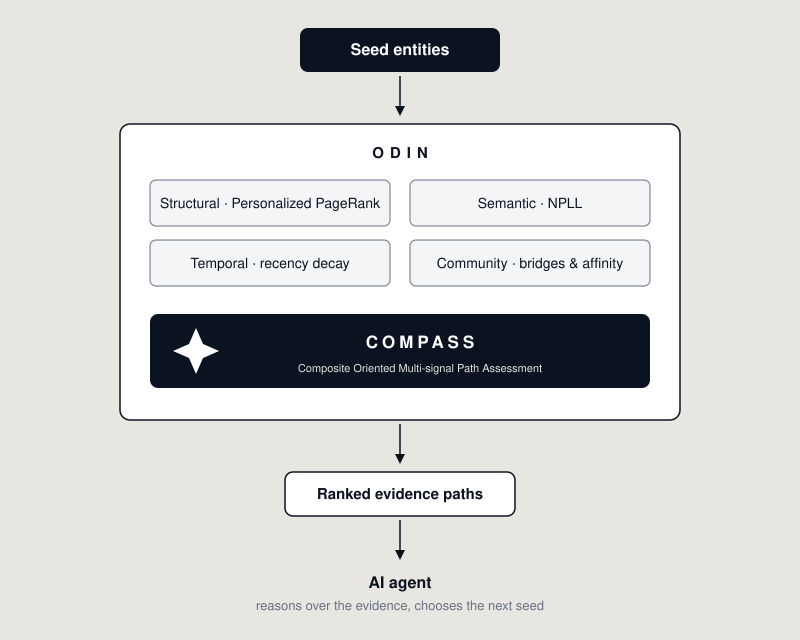
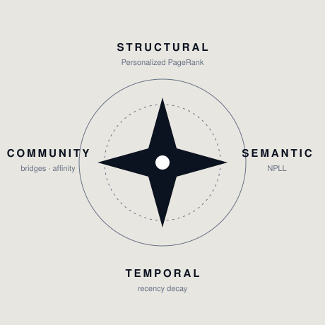
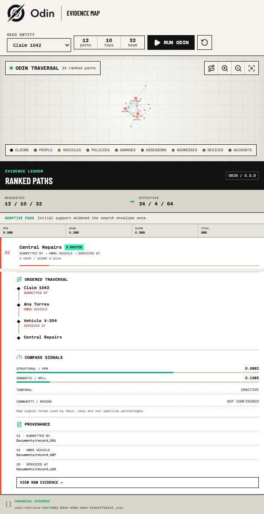
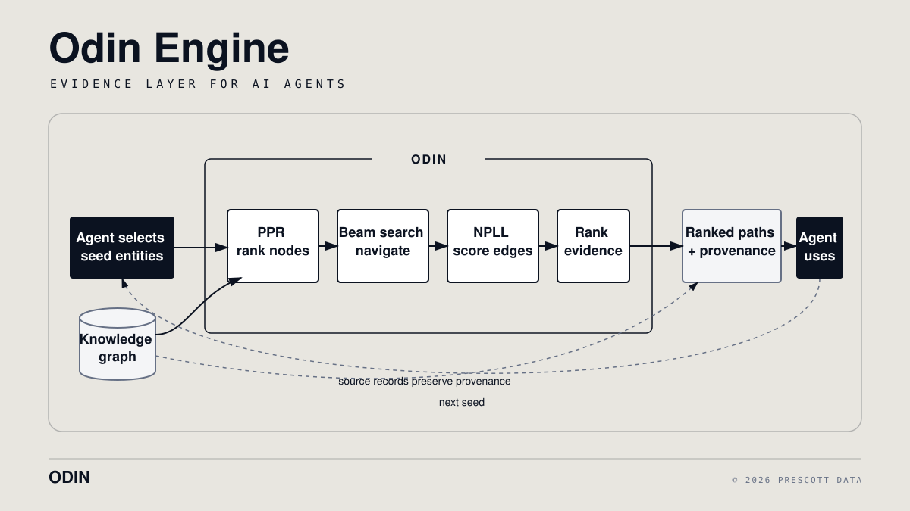

<p align="center">
  
</p>

<p align="center">
  <strong>Graph intelligence that tells AI agents where to look next.</strong>
</p>

<p align="center">
  Multi-signal graph exploration for autonomous AI agents.
</p>

<p align="center">
  <a href="https://arxiv.org/abs/2603.03097">Paper</a> •
  <a href="https://odin.developers.prescottdata.io">Documentation</a> •
  <a href="https://pypi.org/project/odin-engine/">PyPI</a> •
  <a href="#quick-start">Quick Start</a>
</p>

<p align="center">
  <a href="https://pypi.org/project/odin-engine/"></a>
  <a href="https://pypi.org/project/odin-engine/"></a>
  <a href="https://arxiv.org/abs/2603.03097"></a>
  <a href="https://github.com/Prescott-Data/Odin-1/actions/workflows/ci.yml"></a>
  <a href="https://github.com/Prescott-Data/Odin-1/blob/main/LICENSE"></a>
  <a href="https://odin.developers.prescottdata.io/"></a>
</p>

---

## What is Odin?

Odin is an open-source Python library for navigating connected evidence in
knowledge graphs. Given seed entities, it uses Personalized PageRank, bounded
beam search, learned edge-plausibility scoring, and pattern aggregation to
return ranked, inspectable paths. Odin navigates and ranks graph evidence; the
consuming agent interprets that evidence, decides what is missing, and chooses
the next seed or action.

> **Research:** Odin is described in [*Odin: Multi-Signal Graph Intelligence for Autonomous Discovery in Knowledge Graphs*](https://arxiv.org/abs/2603.03097) by Muyukani Kizito and Elizabeth Nyambere, arXiv:2603.03097 (2026).
>
> **Odin-1** is the open-source edition of the Odin graph-intelligence engine, published by Prescott Data under the MIT license so the community can build on it.

---

## Why Odin?

Knowledge graphs are powerful when you already know what you are looking for.
You can write an AQL, Cypher, or SPARQL query for a known relationship. But
autonomous agents face a different question:

> Given these entities, where should I investigate next?

Answering it by traversal alone fails in three ways:

1. **Exponential Path Growth** - A 3-hop exploration from a single node in a densely connected graph can generate 100K+ paths, most of which are noise
2. **Semantic Invalidity** - Naive traversal follows edges that violate domain logic (e.g., `Patient → diagnosed_by → Medication`)
3. **No Prioritization** - Without ranking, agents waste turns analyzing low-value paths while missing critical patterns

**Traditional approaches fail:**
- **BFS/DFS**: Exponential explosion, no signal filtering
- **Fixed Cypher Queries**: Only finds patterns you already know exist
- **Random Walk**: No convergence guarantees, wasted compute
- **LLM Prompting Alone**: Hallucinates relationships, can't verify graph structure

Odin treats graph exploration as a ranking problem:

<p align="center">
    
</p>

The engine ranks connected evidence. The agent decides what that evidence means.

---

## How Odin Works — COMPASS

At the center of Odin is **COMPASS (Composite Oriented Multi-signal Path
Assessment)**, the scoring framework introduced in the
[Odin research paper](https://arxiv.org/abs/2603.03097). Beam search keeps
exploration bounded; COMPASS decides which candidate paths survive each hop.

<p align="center">
    
</p>

| Signal | Role |
|--------|------|
| **Structural importance** | Personalized PageRank identifies graph regions relevant to the selected seeds |
| **Semantic plausibility** | Neural Probabilistic Logic Learning (NPLL), used as a discriminative filter, scores whether observed relationships are plausible |
| **Temporal relevance** | Configurable recency decay prefers evidence relevant to the investigation window |
| **Community awareness** | Bridge entities and inter-community affinity scores keep exploration from getting trapped in dense local clusters (the "echo chamber" problem) |

After ranking, aggregators summarize recurring relationship sequences (motifs),
relation shares, and a 0-100 triage signal that helps an agent decide what to
inspect next. Signals that are not active for a deployment are reported as
inactive in the result rather than silently defaulted.

---

## See Odin Navigate Connected Evidence

This observed run uses Odin `0.3.0` with a synthetic insurance graph containing
66 entities and 190 recorded relationships. Claim 1042 is the selected seed.

The request asked for 12 paths, a 10-hop limit, and a beam width of 32. Odin's
adaptive pass returned 24 ranked paths with an effective 4-hop limit and beam
width of 64. One retained route connects:

```text
Claim 1042
-> submitted_by -> Ana Torres
-> owns_vehicle -> Vehicle V-204
-> serviced_at -> Central Repairs
```

<p align="center">
    
</p>

The interface labels requested and effective bounds, shows inactive signals as
inactive, and traces every edge in the selected path to a source record. The
complete raw result is preserved in the
[canonical run artifact](docs/assets/demo/odin-retrieve-52e74681-8344-438e-b9ee-4fde3173a24f.json).
This is a deterministic demonstration dataset, not a scale or accuracy
benchmark. Odin ranks the connected evidence; the consuming agent or
investigator interprets it and chooses the next action.

---

## Quick Start

### Installation

```bash
# From PyPI (recommended)
pip install odin-engine

# From source
git clone https://github.com/Prescott-Data/Odin-1.git
cd Odin-1
pip install -e .
```

**Requirements:**
- Python 3.9+
- ArangoDB 3.10+ with a populated knowledge graph (reference backend)
- PyTorch 2.0+ (for NPLL)

The example below assumes that the referenced entity IDs already exist in your
graph. Follow the [Getting Started guide](https://odin.developers.prescottdata.io/getting-started/)
for local ArangoDB setup and data-model requirements.

### Minimal Integration

```python
from arango import ArangoClient
from odin import OdinEngine

# 1. Connect to your knowledge graph
client = ArangoClient(hosts="http://localhost:8529")
db = client.db("my_database", username="user", password="pass")

# 2. Initialize Odin (auto-trains NPLL from your graph on first run)
engine = OdinEngine(db=db, community_id="my_community")

# 3. Explore from seed entities
result = engine.retrieve(
    seeds=["entity/claim_123", "entity/provider_456"],
    max_paths=50,
    hop_limit=3,
)

# 4. Access scored paths
print(f"Found {len(result['paths'])} paths")
print(f"Triage Score: {result['triage']['score']}/100")

for p in result['paths'][:5]:
    edges = p['edges']
    nodes = [edges[0]['u'], *(e['v'] for e in edges)] if edges else []
    print(f"  [{p['score']:.2f}]", " -> ".join(str(n) for n in nodes))
```

**Output Example:**
```
Found 47 paths
Triage Score: 87/100
  [0.94] claim_123 → billed_by → provider_456 → flagged_in → audit_07
  [0.89] claim_123 → has_diagnosis → sepsis_dx → rare_in → nursing_home_cluster
  [0.82] provider_456 → prescribed → medication_999 → contraindicated_with → patient_history
```

### Self-Managing Intelligence

Odin automatically manages its NPLL model lifecycle:

1. **First Run**: Extracts edge patterns from your graph and trains the NPLL model
2. **Stores Weights**: Saves learned parameters in ArangoDB collection (`NPLLWeights`)
3. **Subsequent Runs**: Loads weights from the database and rebuilds the model

**No separate ML pipeline, no .pt files, no DevOps overhead.** Just initialize `OdinEngine` and it handles everything.

---

## What Agents Get Back

Every `retrieve()` call returns ranked paths with per-edge provenance, plus
aggregates an agent can act on (see the
[Result Schema](https://odin.developers.prescottdata.io/reference/result-schema/)
for the full shape):

```python
{
    "topk_ppr": [...],
    "paths": [
        {
            "id": "path_0",
            "score": 0.94,
            "edges": [
                {"u": "entity/A", "v": "entity/B", "relation": "billed_by",
                 "confidence": 0.89, "created_at": "...", "provenance": {...}}
            ]
        }
    ],
    "insight_score": 0.82,
    "aggregates": {
        "motifs": [{"pattern": "billed_by->flagged_in", "edge_count": 12, "path_count": 6}],
        "relation_share": {"billed_by": {"count": 42, "share": 0.42}},
        "summary": {...}
    },
    "triage": {"score": 87, "components": {...}, "dominant_relation": {...}}
}
```

Beyond `retrieve()`, the engine exposes companion capabilities — edge
plausibility scoring, anchor discovery, motif aggregates, and runtime schema
introspection — summarized in [API at a Glance](#api-at-a-glance) and fully
documented on the [docs site](https://odin.developers.prescottdata.io).

---

## Research

> 📄 **[Odin: Multi-Signal Graph Intelligence for Autonomous Discovery in Knowledge Graphs](https://arxiv.org/abs/2603.03097)**
>
> Muyukani Kizito · Elizabeth Nyambere
>
> Prescott Data · 2026
>
> [arXiv:2603.03097](https://arxiv.org/abs/2603.03097) · [DOI: 10.48550/arXiv.2603.03097](https://doi.org/10.48550/arXiv.2603.03097)

The paper introduces:

- the autonomous knowledge-graph discovery problem: surfacing meaningful patterns from seed entities without specifying the target pattern in advance;
- the COMPASS multi-signal path scoring framework;
- NPLL used as a discriminative filter over existing graph relationships rather than a generative model;
- bridge-entity and community-affinity guidance for the "echo chamber" problem in dense graph communities;
- bounded beam-search exploration with O(b·h) complexity relative to exhaustive traversal; and
- provenance-preserving exploration for regulated environments.

See [Citation](#citation) to cite the paper or the software.

---

## Architecture

Odin turns seed entities into ranked, inspectable graph evidence:

<p align="center">
    
</p>

Odin navigates and ranks connected evidence. The consuming agent interprets the
returned paths and either acts on them or selects another seed for retrieval.

**Component Details:**

| Layer | Responsibility |
|-------|----------------|
| **Graph Accessor** | Read and cache graph neighborhoods |
| **PPR Engine** | Compute seed-relative structural importance |
| **Beam Search** | Explore bounded multi-hop paths |
| **NPLL Confidence** | Add learned edge-plausibility signals |
| **Aggregators** | Summarize motifs, relation shares, and triage signals |

---

## Use Cases

### 1. Healthcare Fraud Detection
**Scenario:** Find providers billing unusual procedure combinations

```python
engine = OdinEngine(db, community_id="medicare_claims")
result = engine.retrieve(
    seeds=["provider/high_volume_clinic"],
    max_paths=100,
)
# Odin surfaces: "CPT_99285 + CPT_office_visit" pattern in 34 claims
```

### 2. Supply Chain Risk Analysis
**Scenario:** Identify cascading supplier dependencies

```python
result = engine.retrieve(
    seeds=["supplier/critical_vendor"],
    hop_limit=5,  # Deep supply chain exploration
)
# Discovers: Tier-3 supplier affects 47 downstream products
```

### 3. Regulatory Compliance Checks
**Scenario:** Validate entity relationships against compliance rules

```python
score = engine.score_edge(
    head="entity/investment_fund",
    relation="managed_by",
    tail="entity/sanctioned_entity"
)
if score > 0.5:
    compliance_agent.flag_for_review()
```

---

## Documentation

| Document | Description |
|----------|-------------|
| [**Documentation Site**](https://odin.developers.prescottdata.io) | Full guides, concepts, and API reference |
| [**Research Paper**](https://arxiv.org/abs/2603.03097) | COMPASS and the autonomous discovery problem (arXiv:2603.03097) |
| [**Architecture**](whitepaper/ARCHITECTURE.md) | Complete technical design |
| [**Agent Integration Guide**](whitepaper/AGENT_INTEGRATION_GUIDE.md) | How to integrate with AI agents |
| [**Whitepaper**](whitepaper/ODIN_WHITEPAPER.md) | Research background and evaluation |

---

## API at a Glance

```python
from odin import OdinEngine

engine = OdinEngine(
    db: StandardDatabase,              # ArangoDB connection
    community_id: str = "global",      # Scope for exploration
    cache_size: int = 5000,            # LRU cache size
    auto_train: bool = True,           # Auto-train NPLL if needed
    community_mode: str = "none"       # "none" | "mapping"
)
```

| Method | Purpose |
|--------|---------|
| `retrieve(seeds, max_paths=50, hop_limit=3, beam_width=64)` | Find and score paths from seed entities |
| `score_edge(src, rel, dst)` | Score plausibility of a single edge (0.0-1.0) |
| `find_anchors(seeds, topn=20)` | Top-N nodes by Personalized PageRank |
| `retrain_model(force_retrain=True)` | Force NPLL retraining after major graph updates |
| `SchemaInspector(db)` | Inspect collections, fields, and edge relationships at runtime |

Full parameter and result documentation lives in the
[API reference](https://odin.developers.prescottdata.io).

---

## Performance

Runtime depends on graph density, database latency, retrieval bounds, cache
state, and whether NPLL weights are already available. The repository includes
performance and memory regression tests in [`tests/performance`](tests/performance/)
and benchmark utilities in [`benchmarks`](benchmarks/). Publish workload-specific
measurements with the dataset, parameters, hardware, and Odin version used.

---

## Testing

```bash
# Run all tests
pytest tests/ -v

# Unit tests only
pytest tests/unit/ -v

# Integration tests
pytest tests/integration/ -v

# With coverage report
pytest tests/ --cov=odin --cov=npll --cov=retrieval --cov-report=html
```

---

## Contributing

We welcome contributions! Areas of interest:

- **Scalability**: Optimizations for graphs >10M entities
- **Algorithms**: Alternative PPR implementations, new aggregators
- **Database Support**: Neo4j, Neptune adapters
- **Benchmarks**: Academic dataset comparisons

---

## License

MIT License - see [LICENSE](LICENSE) for details.

---

## Authors

**Prescott Data**
- Muyukani Kizito - Lead Engineer
- Elizabeth Nyambere - NPLL & GNN Research

---

## Citation

If Odin contributes to your research, please cite the paper:

```bibtex
@article{kizito2026odin,
  title={Odin: Multi-Signal Graph Intelligence for Autonomous Discovery in Knowledge Graphs},
  author={Kizito, Muyukani and Nyambere, Elizabeth},
  journal={arXiv preprint arXiv:2603.03097},
  year={2026},
  doi={10.48550/arXiv.2603.03097}
}
```

To cite the software implementation specifically:

```bibtex
@software{odin_engine,
  title={Odin: Graph Intelligence for Autonomous AI Agents},
  author={Prescott Data},
  year={2026},
  url={https://github.com/Prescott-Data/Odin-1}
}
```

---

## Links

- [PyPI Package](https://pypi.org/project/odin-engine/)
- [Documentation](https://odin.developers.prescottdata.io)
- [GitHub Repository](https://github.com/Prescott-Data/Odin-1)
- [Prescott Data](https://prescottdata.io)
