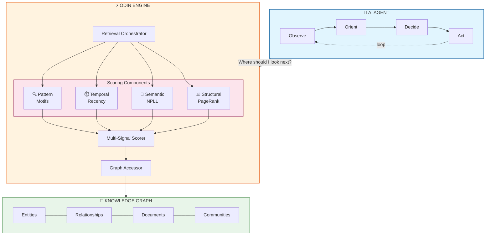

# Odin: A Graph Intelligence Engine for Autonomous Insight Discovery

**White Paper v1.1**  
**January 2026**

**Authors:** Muyukani Kizito, Elizabeth Nyambere  
**Organization:** Prescott Data (https://prescottdata.io)

---

## Table of Contents

1. [Executive Summary](#executive-summary)
2. [Abstract](#abstract)
3. [Introduction](#1-introduction)
4. [The Problem in Depth](#2-the-problem-in-depth)
5. [The Odin Architecture](#3-the-odin-architecture)
6. [Key Innovations](#4-key-innovations)
7. [System Architecture](#5-system-architecture)
8. [Applications](#6-applications)
9. [Results and Impact](#7-results-and-impact)
10. [Related Work](#8-related-work)
11. [Limitations](#9-limitations)
12. [Future Directions](#10-future-directions)
13. [Getting Started](#11-getting-started-with-odin)
14. [Conclusion](#12-conclusion)
15. [Glossary](#glossary)
16. [References](#references)

---

## Executive Summary

**The Challenge:** Organizations are investing heavily in knowledge graphs to represent their data, but struggle to extract actionable insights. Traditional query-based approaches only find patterns analysts already know to look for—they cannot discover the unknown.

**The Solution:** Odin is a graph intelligence engine that enables AI agents to autonomously explore knowledge graphs and surface meaningful patterns without pre-specification. Unlike systems that answer known questions, Odin tells agents *where to look*, combining structural importance (PageRank), semantic plausibility (probabilistic logic), and temporal relevance into a unified scoring framework.

**Key Differentiators:**
- **Discovery, not retrieval:** Finds patterns analysts haven't thought to query
- **Agent-oriented:** Designed for repeated calls during AI exploration loops
- **Explainable:** Every recommendation decomposes into auditable components
- **Evidence-grounded:** No hallucination—every insight traces to source documents

**Results:** In production deployments for healthcare and insurance customers, Odin-powered agents have discovered previously unknown cross-department patterns, reduced analyst exploration time significantly, and satisfied regulatory audit requirements through full traceability.

**For:** CTOs, VP Engineering, AI/ML Leaders, and Data Science teams building intelligent applications on knowledge graphs.

---

## Abstract

Knowledge graphs offer rich, interconnected representations of organizational data, yet extracting actionable insights from them remains a significant challenge. Traditional approaches rely on pre-defined queries that can only find patterns analysts already know to look for. We present **Odin**, a graph intelligence engine that enables AI agents to autonomously discover meaningful patterns in knowledge graphs without prior specification of what to find.

Odin introduces a novel **multi-signal scoring framework** that combines structural importance, semantic plausibility, and temporal relevance to guide exploration. Unlike retrieval systems that answer known questions, Odin acts as an intelligent compass—telling agents where to look rather than what they'll find. This separation of graph intelligence from natural language reasoning creates a modular, explainable architecture for autonomous insight discovery.

We describe the core innovations behind Odin, its architecture, and its application to enterprise domains including healthcare analytics and insurance operations, where it powers real-time insight generation for decision-makers.

---

## 1. Introduction

### 1.1 The Promise of Knowledge Graphs

Organizations are increasingly adopting knowledge graphs to represent their data. Unlike flat document stores or siloed databases, knowledge graphs capture:

- **Entities** (patients, claims, diagnoses, providers)
- **Relationships** (prescribed, diagnosed_with, processed_by)
- **Provenance** (which document, which page, when extracted)
- **Multi-modal content** (text, tables, images)

This rich structure should, in theory, enable sophisticated analysis. A knowledge graph containing hospital data could reveal patterns like "patients from nursing facility X have elevated sepsis rates" or "Provider Y handles 40% of high-value claims"—patterns invisible in traditional data stores.

### 1.2 The Reality: Query-Based Systems Hit a Wall

In practice, extracting insights from knowledge graphs faces fundamental limitations:

**Problem 1: You can only find what you query for.**

Traditional approaches (Cypher, SPARQL, AQL) require analysts to specify the exact pattern they're seeking:

```
MATCH (p:Patient)-[:DIAGNOSED_WITH]->(d:Diagnosis {name: 'Sepsis'})
WHERE p.source_facility = 'NursingHomeX'
RETURN p, d
```

This works when you know the question. But what about patterns you haven't thought to ask about? What about cross-domain correlations? What about emerging trends in new data?

**Problem 2: Exploration explodes exponentially.**

A naive exploration strategy—follow all edges, explore all neighbors—leads to exponential blowup. A 3-hop exploration from a single node in a graph with average degree 50 visits 125,000 nodes. Most of these paths are noise.

**Problem 3: Not all connections are meaningful.**

Just because two entities are connected doesn't mean the connection is significant. A patient connected to a common diagnosis shares that link with thousands of others. Meaningful insights require distinguishing signal from noise.

### 1.3 Our Approach: The Compass, Not the Explorer

Odin takes a fundamentally different approach. Rather than retrieving answers to known questions, Odin provides **intelligent guidance** for exploration.

We draw an analogy to navigation:

| Traditional RAG | Odin |
|-----------------|------|
| "Here is the answer to your question" | "The most promising direction is northwest" |
| Retrieves facts | Scores possibilities |
| Answers questions | Enables discovery |

Odin is the **compass** that tells AI agents where to look. The agents—powered by large language models—interpret what they find and generate human-readable insights.

This separation provides several advantages. Graph intelligence is decoupled from language understanding, allowing each component to evolve independently. Every recommendation has a traceable score, enabling auditing and debugging. Agents explore high-value paths rather than random walks, dramatically improving efficiency. And because Odin provides a general-purpose intelligence layer, different agents can leverage the same infrastructure with different objectives.

---

## 2. The Problem in Depth

### 2.1 Autonomous Insight Discovery

We define **autonomous insight discovery** as the task of identifying meaningful, non-obvious patterns in a knowledge graph without prior specification of what patterns to find.

This differs from:
- **Question answering**: "What drugs is Patient X taking?" (known question)
- **Pattern matching**: "Find all patients with Condition Y" (known pattern)
- **Graph completion**: "Predict missing link between A and B" (single edge)

Autonomous discovery asks: "What should we pay attention to?" This is what human analysts do—they explore data, notice anomalies, connect disparate facts, and surface insights.

### 2.2 Requirements for Autonomous Discovery

Through our work with enterprise customers, we identified key requirements:

**R1: Multi-hop reasoning.** Insights often span multiple relationships. "Patient admitted via ER → Diagnosed with sepsis → Treated by Dr. X → Mortality within 48 hours" requires following a chain.

**R2: Prioritization.** Not all paths deserve equal attention. Agents need guidance on which directions are most promising.

**R3: Plausibility filtering.** Some connections, while structurally present, are semantically implausible or data errors. These should be deprioritized.

**R4: Evidence grounding.** Every insight must trace back to source documents. No hallucination.

**R5: Scale.** Enterprise graphs contain millions of entities. Exploration must be efficient.

**R6: Real-time capability.** Users expect interactive response times when drilling into insights.

### 2.3 Why Existing Approaches Fall Short

**Vector RAG** embeds documents and retrieves by similarity. It lacks relationship awareness—it can find similar documents but cannot reason over structured connections.

**Graph RAG** (query-based) requires knowing what to query. It cannot discover unknown patterns.

**Random walk methods** explore broadly but without direction. They waste computation on low-value paths.

**GNN-based methods** require labeled training data and produce opaque recommendations. They struggle with explainability requirements.

### 2.4 Comparison with Existing Approaches

| Capability | Vector RAG | Query-Based Graph RAG | Random Walks | GNN Methods | **Odin** |
|------------|------------|----------------------|--------------|-------------|----------|
| Discovers unknown patterns | ❌ | ❌ | ⚠️ Undirected | ⚠️ Opaque | ✅ |
| Multi-hop reasoning | ❌ | ✅ Manual | ✅ | ✅ | ✅ |
| Relationship-aware | ❌ | ✅ | ✅ | ✅ | ✅ |
| Explainable scores | ⚠️ Similarity only | ❌ | ❌ | ❌ | ✅ |
| Semantic filtering | ❌ | ❌ | ❌ | ⚠️ Implicit | ✅ |
| Agent-oriented (repeated calls) | ❌ | ❌ | ⚠️ | ❌ | ✅ |
| Evidence-grounded | ⚠️ | ✅ | ✅ | ⚠️ | ✅ |
| Scales to millions of entities | ✅ | ✅ | ⚠️ | ⚠️ | ✅ |
| No labeled training data required | ✅ | ✅ | ✅ | ❌ | ✅ |

---

## 3. The Odin Architecture

Odin provides a **multi-signal scoring framework** that guides exploration through knowledge graphs. At its core, Odin answers: "Given where I am in the graph, which neighbors are most worth exploring?"

### 3.1 Design Philosophy

**Principle 1: Separate intelligence from reasoning.**

Odin provides graph intelligence—which paths are important, plausible, and relevant. Large language models provide reasoning—what do these paths mean? This separation keeps both components focused.

**Principle 2: Score, don't retrieve.**

Odin doesn't return answers. It returns scored candidates. Agents decide how to use these scores.

**Principle 3: Explain everything.**

Every score decomposes into interpretable components. Users can audit why a particular path was prioritized.

**Principle 4: Design for agents.**

Odin is built to be called repeatedly during agent exploration loops. Low latency and cacheability are first-class concerns.

### 3.2 Architecture Overview



**Diagram Legend:**
- **AI Agent**: Implements OODA loop (Observe-Orient-Decide-Act), repeatedly queries Odin for navigation guidance
- **Odin Engine**: Coordinates scoring across structural, semantic, temporal, and pattern signals
- **Knowledge Graph**: The underlying data store with entities, relationships, source documents, and community structure

### 3.3 Core Components

**Retrieval Orchestrator**

The main entry point. Accepts seed entities and exploration parameters, coordinates all scoring components, and returns ranked paths with decomposed scores.

**Structural Importance (PageRank)**

We employ Personalized PageRank (PPR) to identify structurally important nodes relative to the current exploration context. PPR answers: "If I randomly walked from my current position, which nodes would I visit most often?"

Odin implements multiple PPR variants optimized for different scenarios. Local approximation algorithms provide low-latency computation suitable for interactive use. Monte Carlo sampling offers broader coverage when exhaustiveness matters more than speed. Bidirectional computation enables target-aware scoring when agents have specific destination entities in mind.

**Semantic Plausibility (NPLL)**

Not all edges in a knowledge graph are equally reliable. Data extraction errors, temporal invalidity, and domain violations create edges that are structurally present but semantically implausible.

Odin incorporates **Neural Probabilistic Logic Learning (NPLL)**—a technique that scores edge plausibility based on learned patterns from the knowledge graph. Unlike traditional systems that use probabilistic logic to *generate* new edges, Odin uses NPLL as a *filter* during traversal—edges that violate learned constraints are deprioritized. This key innovation is detailed in Section 4.1.

**Temporal Relevance**

Recent data often matters more than historical data. Odin incorporates recency scoring with configurable decay functions, allowing agents to balance historical context against current relevance.

**Pattern Detection**

Beyond individual paths, Odin identifies recurring structural patterns (motifs) that may indicate systematic phenomena. A single patient with multiple claims is noise; 47 patients with identical claim patterns is a potential fraud ring.

### 3.4 Multi-Signal Scoring

The key innovation in Odin is the **unified multi-signal scoring function** that combines all signals during beam search exploration.

At each step, when deciding which neighbors to explore, Odin computes:

```
PathScore = f(StructuralImportance, SemanticPlausibility, TemporalRelevance, EdgePrior)
```

This unified score guides beam search, ensuring that exploration follows paths that are structurally important (central, highly connected), semantically plausible (valid, not data errors), temporally relevant (recent, contextually fitting), and informative (high prior likelihood of yielding insights). The specific combination function and weights are tuned per deployment based on domain characteristics and customer priorities.

### 3.5 Beam Search Exploration

Odin uses beam search to efficiently explore multi-hop paths. Unlike exhaustive search (which grows exponentially) or random walk (which lacks direction), beam search provides a principled middle ground.

The algorithm begins at seed entities and scores all neighbor extensions using the multi-signal function. It then keeps only the top-K highest-scoring candidates—the "beam width"—and discards the rest. This process repeats for each hop up to the desired depth. Finally, the algorithm returns the highest-scoring complete paths discovered during exploration.

This approach provides a principled trade-off between exploration breadth and computational efficiency. By focusing computation on the most promising paths at each step, beam search achieves coverage comparable to exhaustive methods while requiring orders of magnitude less computation.

---

## 4. Key Innovations

### 4.1 Neural Probabilistic Logic Learning (NPLL)

Odin's semantic plausibility layer is powered by **Neural Probabilistic Logic Learning (NPLL)**—a technique that combines logical reasoning with neural scoring to evaluate edge quality.

**How NPLL Works**

NPLL integrates three paradigms into a unified scoring framework:

1. **Logical Rules**: Patterns extracted from the knowledge graph, such as "If entity X has relation A to entity Y, and entity Y has relation B to entity Z, then X likely has relation C to Z." These rules capture domain-specific constraints and common patterns.

2. **Neural Scoring**: Entity and relation embeddings that enable generalization beyond exact pattern matches. A bilinear scoring function learns which entity-relation combinations are plausible.

3. **Probabilistic Training**: An Expectation-Maximization (E-M) algorithm that learns rule weights from observed data, balancing the contribution of different rules based on their predictive power.

**NPLL as Filter, Not Generator**

Traditional knowledge graph completion systems use probabilistic logic to **generate** new edges—predicting missing links. Odin inverts this: we use NPLL to **filter** existing edges during traversal.

This difference is crucial:

| Generation (Traditional) | Filtering (Odin) |
|--------------------------|------------------|
| "Predict: Does edge X→Y exist?" | "Given X→Y exists, how plausible is it?" |
| Adds uncertainty (hallucination risk) | Removes uncertainty (grounds in data) |
| Computationally expensive (all pairs) | Computationally cheap (only visited edges) |
| Requires exhaustive training | Works with partial training |

**Example in Practice**

In a healthcare knowledge graph, NPLL scores paths based on learned patterns:

- "Patient → diagnosed_with → Sepsis → treated_with → Antibiotics" scores **high** (plausible medical sequence)
- "Patient → diagnosed_with → Fracture → treated_with → Antibiotics" scores **lower** (unusual treatment choice)

NPLL acts as a **semantic filter**—identifying edges that are structurally present but semantically unlikely. By using it as a discriminative filter rather than a generative model, Odin maintains the evidence-grounding guarantees that enterprise applications require while still benefiting from learned semantic patterns.

### 4.2 Community-Aware Exploration

Large knowledge graphs naturally cluster into communities—groups of densely connected entities representing coherent domains or topics. Odin leverages community structure generated through Graph Neural Network-based detection methods during graph construction.

This community awareness provides three benefits. First, exploration can be scoped to relevant communities, avoiding wasteful traversal into unrelated domains. Second, cross-community connections are explicitly tracked and often represent high-signal discoveries—when an entity bridges two otherwise separate clusters, this frequently indicates an insight worth investigating. Third, community-level statistics inform exploration priorities, allowing agents to focus on communities with recent activity or unusual patterns.

The result is a dramatic reduction in search space while preserving—indeed, enhancing—the ability to discover cross-domain insights.

### 4.3 Agent-Oriented Design

Odin is designed to be called repeatedly during agent exploration loops, not as a one-shot retrieval:

```
Agent Loop:
  1. Agent at position P with hypothesis H
  2. Call Odin: "Score my neighbors given H"
  3. Odin returns scored candidates
  4. Agent selects direction, moves
  5. Agent updates hypothesis
  6. Repeat
```

This supports the OODA (Observe-Orient-Decide-Act) loop that effective AI agents use. The agent observes its current graph position and accumulated context. Odin provides orientation by scoring available options based on structural, semantic, and temporal signals. The agent decides which direction to pursue—potentially using LLM reasoning to weigh Odin's scores against its current hypothesis. And the agent acts by moving to the selected node and updating its internal state. This cycle repeats until the agent reaches a termination condition or exhausts its exploration budget.

### 4.4 Self-Managing Intelligence

A core architectural principle of Odin is that the **intelligence engine should manage its own intelligence**. Unlike systems that require manual model training and deployment, Odin's NPLL layer is fully self-managing.

**The Challenge:**

Traditional ML-powered systems require explicit model training pipelines, file management, and deployment orchestration. This creates operational burden and introduces opportunities for model staleness—where the inference model drifts from the current data.

**Odin's Solution:**

Odin manages the complete NPLL lifecycle automatically:

1. **Auto-Training**: When Odin connects to a knowledge graph database, it checks for existing model weights. If none exist, it automatically extracts patterns from the graph, generates domain-aware rules, trains the NPLL model, and persists the learned weights—all without user intervention.

2. **Weights-Only Storage**: Instead of storing large model files (which can reach hundreds of megabytes), Odin stores only the learned rule weights (typically a few hundred bytes) directly in the database. The rest of the model—entity embeddings, relation embeddings, grounded rules—is rebuilt from the knowledge graph data on demand. This keeps storage minimal while maintaining full reproducibility.

3. **Domain-Aware Rule Generation**: Odin automatically analyzes the relations present in the knowledge graph and generates appropriate logical rules. Healthcare graphs receive rules about diagnoses, treatments, and patient journeys. Insurance graphs receive rules about claims, policies, and provider patterns. Generic graphs receive universal patterns that apply across domains.

4. **Graceful Fallback**: If NPLL training fails for any reason (insufficient data, corrupted graph, timeout), Odin falls back to constant-confidence scoring rather than failing entirely. The system continues to provide structural and temporal guidance while the semantic layer is unavailable.

This self-managing approach ensures that Odin's intelligence always reflects the current state of the knowledge graph, eliminating model staleness and reducing operational overhead.

### 4.5 Explainable Scores

Every score Odin produces decomposes into interpretable components:

```
Path: Patient→Diagnosis→Treatment→Outcome
Score: 0.73
  ├── Structural: 0.81 (high PageRank, central nodes)
  ├── Plausibility: 0.92 (semantically valid sequence)
  ├── Temporal: 0.65 (6-month-old data)
  └── Prior: 0.54 (moderately common pattern)
```

This explainability is critical across multiple dimensions. Engineers can debug agent behavior by examining which signals drove particular exploration choices. Quality assurance teams can audit insight quality by reviewing the component scores. Business users develop trust when they can see *why* a particular pattern was surfaced. And in regulated industries—particularly healthcare and financial services—the ability to trace every recommendation to its constituent scores satisfies compliance requirements that opaque systems cannot meet.

---

## 5. System Architecture

### 5.1 Deployment Model

Odin is designed as a **library** that agents import, not a standalone service:

```python
from arango import ArangoClient
from odin import OdinEngine

# Connect to knowledge graph database
client = ArangoClient(hosts="http://localhost:8529")
db = client.db("knowledge_graph", username="user", password="pass")

# Initialize Odin - NPLL auto-trains if needed
odin = OdinEngine(db=db, community_id="healthcare")

# Use during agent exploration
result = odin.retrieve(
    seeds=["entity/patient_12345"],
    max_paths=50,
    hop_limit=3,
)

# Score individual edges for fine-grained decisions
score = odin.score_edge(
    src="entity/patient_12345",
    rel="diagnosed_with",
    dst="entity/sepsis",
)
```

This design provides several advantages. First, it eliminates the network latency that would come from a separate service, allowing agents to query Odin in microseconds rather than milliseconds. Second, the `OdinEngine` automatically manages NPLL model lifecycle—training, loading, and retraining—without user intervention. Each agent can configure Odin with different parameters—exploration depth, signal weights, community scope—without affecting other agents. And there is no additional infrastructure to deploy or maintain; Odin runs in the same process as the agent itself.

### 5.2 Production Optimizations

Enterprise deployment requires careful attention to:

**Caching.** Repeated traversals often visit the same nodes—an agent exploring from Entity A may later explore from Entity B, which shares neighbors with A. Odin implements LRU caching at multiple levels to exploit this locality. Neighbor lists are cached because they represent the most frequent access pattern. PageRank scores are cached because they are expensive to recompute. Plausibility scores are cached because model inference carries non-trivial cost.

**Memory Management.** Unbounded caches have caused production incidents in many systems—memory grows until the process is killed. All caches in Odin are bounded with configurable limits, ensuring predictable memory consumption regardless of exploration patterns.

**Graceful Degradation.** If the plausibility model fails—whether due to missing embeddings, model corruption, or infrastructure issues—Odin falls back to structural-only scoring rather than failing entirely. Agents continue to receive guidance, albeit without semantic filtering. This robustness is essential for production systems that cannot afford downtime.

### 5.3 Database Abstraction

Odin operates through a database abstraction layer that decouples graph intelligence from storage infrastructure. The primary implementation targets ArangoDB, with adapters available for Neo4j and in-memory graphs (the latter primarily for testing and development). This abstraction ensures that organizations can deploy Odin against their existing graph infrastructure without migration—a critical consideration for enterprises with established data platforms.

---

## 6. Applications

### 6.1 Healthcare Analytics

In healthcare deployments, knowledge graphs contain:
- Patient records, diagnoses, treatments, outcomes
- Provider relationships, referral patterns
- Facility data, equipment usage
- Clinical notes, lab results (as text blocks)

Odin enables discovery of patterns such as:

**Clinical Quality**
- "Patients with Condition X who receive Treatment Y within 24 hours have 40% better outcomes"
- "Provider Z has elevated readmission rates for cardiac patients"

**Operational Efficiency**
- "Lab orders from Department A take 3x longer to complete"
- "Equipment utilization in Building 2 peaks Tuesdays, idles weekends"

**Safety Signals**
- "Drug interaction pattern detected in 7 current patients"
- "Infection cluster among patients in adjacent rooms"

### 6.2 Insurance Operations

Insurance knowledge graphs contain:
- Claims, policies, policyholders
- Providers, assessors, repair facilities
- Incident reports, damage assessments
- Payment histories, fraud flags

Odin enables discovery of patterns such as:

**Fraud Detection**
- "Three claims from different policyholders share identical damage descriptions"
- "Assessor X approves 4x the average claim value"
- "Ring pattern: Same garage servicing claims across multiple 'unrelated' policyholders"

**Operational Insights**
- "Claims processed by Team A close 2 days faster"
- "Policy renewals drop 60% after claim disputes"

**Risk Assessment**
- "Properties in Zone X have 3x water damage claims"
- "Commercial policies with Rider Y have elevated loss ratios"

### 6.3 The Two-Mode Architecture

We deploy Odin in two complementary modes that together provide comprehensive insight coverage.

In **Offline (Proactive) Mode**, agents run on a schedule—typically nightly or triggered by new data ingestion. They systematically explore the graph starting from high-priority seed entities, surfacing patterns that meet significance thresholds. These discoveries are packaged into "Briefs" that users review each morning, and aggregated into "Data Stories" for domain-specific channels. This mode prioritizes thoroughness over speed.

In **Online (Reactive) Mode**, users ask questions or request deep dives into specific entities or patterns. Agents use Odin for real-time exploration with strict latency requirements—typically under 5 seconds for interactive response. Users can refine their queries based on initial results, driving iterative exploration. This mode prioritizes responsiveness over exhaustiveness.

The same Odin engine serves both modes; only the parameter tuning differs. Offline mode uses wider beams and deeper hops; online mode uses narrower beams with aggressive caching.

---

## 7. Results and Impact

### 7.1 Deployment Outcomes

Odin has been deployed in production environments across healthcare and insurance domains. While specific metrics are customer-confidential, we report anonymized outcomes:

**Discovery of Unknown Patterns.** In a healthcare deployment, Odin-powered agents identified a correlation between patient transfer patterns and readmission rates that had not been previously investigated. The pattern—specific referring facilities associated with elevated 30-day readmissions—led to a process change in transfer protocols. In an insurance deployment, agents surfaced a provider network pattern suggesting coordinated claims across ostensibly unrelated policyholders, a pattern that manual review had missed due to the multi-hop nature of the connections.

**Efficiency Improvements.** Analysts consistently report a qualitative shift in their workflow: from "query writing and waiting" to "reviewing and deciding." The exploratory phase of analysis—previously requiring custom queries for each hypothesis—is now handled autonomously by agents. Time-to-first-insight for new investigations has been reduced from hours or days to minutes, as agents can immediately begin exploration rather than waiting for query development.

**Insight Quality.** Evidence-grounded insights with decomposed scores achieve higher adoption by business users, who can examine the reasoning behind each recommendation. Audit trails satisfy compliance requirements without additional documentation effort—the scores themselves constitute the audit record. False positive rates on surfaced patterns are significantly lower than rule-based alerting systems, as the multi-signal scoring naturally filters implausible connections.

**System Performance.** Interactive query response consistently falls under 5 seconds for online mode, meeting user expectations for responsive exploration. Nightly batch processing handles full graph re-exploration for proactive insight generation without impacting daytime operations. Cache hit rates exceed 80% during typical exploration sessions, substantially reducing database load and enabling more aggressive exploration within latency budgets.

### 7.2 Case Study: Insurance Claims Analysis (Anonymized)

**Context:** A mid-size insurance carrier deployed Odin to analyze their claims knowledge graph containing policyholder, claim, provider, and assessor entities.

**Challenge:** The fraud investigation team relied on rule-based alerts that generated high false positive rates and missed sophisticated patterns involving multiple parties.

**Deployment:** Odin-powered agents were configured to run nightly, exploring the graph starting from high-value recent claims and surfacing unusual patterns.

**Discovery:** Within the first month, agents identified a pattern that had escaped existing detection rules. Three policyholders with no apparent connection had filed claims within a 6-week window. All three claims were serviced by the same repair facility and approved by the same assessor. The damage descriptions exhibited unusual textual similarity—phrases and sentence structures that were statistically unlikely to occur independently.

This pattern had not triggered any existing rules because no single attribute was anomalous; only the combination across multiple dimensions signaled coordinated activity. Manual investigation confirmed the pattern represented a coordinated scheme.

**Outcome:** The pattern, once identified, was added to monitoring. The decomposed Odin scores (showing high structural centrality of the repair facility, temporal clustering, and cross-policyholder connections) provided the investigative team with a clear audit trail.

### 7.3 Efficiency Characteristics

Odin's guided exploration provides significant efficiency gains over naive approaches:

| Approach | Paths Explored (3-hop, degree 50) | Complexity |
|----------|-----------------------------------|------------|
| Exhaustive BFS | 125,000 | O(d^h) |
| Random Walk (1000 walks) | 3,000 | O(walks × length) |
| **Odin Beam Search (beam=64)** | 192 | O(beam × hops) |

This efficiency comes without sacrificing coverage—the multi-signal scoring ensures the 192 paths explored are the *most likely* to yield insights.

---

## 8. Related Work

### 8.1 Graph RAG Systems

The integration of knowledge graphs with retrieval-augmented generation has received significant attention:

**Microsoft GraphRAG** (Edge et al., 2024) uses graph structure to improve document retrieval for question answering. It constructs community hierarchies and generates summaries at each level. Odin differs fundamentally: GraphRAG answers known questions using graph-enhanced retrieval, while Odin enables discovery of unknown patterns through guided exploration.

**Neo4j GraphRAG** provides native vector search combined with graph traversal. It excels at hybrid retrieval but relies on query specification—users must define the Cypher patterns to match.

**LlamaIndex Knowledge Graphs** offers knowledge graph construction and querying within a RAG pipeline. Like Neo4j, it is query-oriented rather than discovery-oriented.

Odin complements these systems: they answer questions, Odin finds questions worth asking.

### 8.2 Knowledge Graph Embedding and Reasoning

The knowledge graph completion literature provides foundational techniques:

**Translational Models** (TransE, TransR, RotatE) learn embeddings such that valid triples have low distance in embedding space. These excel at link prediction but are generative—they predict missing edges.

**Tensor Factorization** (RESCAL, ComplEx, TuckER) model relations as transformations on entity embeddings. They achieve strong benchmark performance but require full retraining for new entities.

**Probabilistic Logic** (Markov Logic Networks, Neural LP, DRUM) combine logical rules with probabilistic inference. Odin's NPLL layer builds on this tradition but applies it differently: as a discriminative filter during traversal rather than a generative model.

The key distinction is usage: these methods predict whether edges *should* exist; Odin scores whether existing edges *should be followed*.

### 8.3 Graph Neural Networks

**Message Passing Networks** (GCN, GAT, GraphSAGE) learn node representations through neighborhood aggregation. R-GCN extends this to heterogeneous graphs common in knowledge graph settings.

While powerful, these approaches present limitations for autonomous discovery. They require labeled training data for supervised tasks, which is often unavailable for novel insight types. They produce opaque embeddings that are difficult to audit—a significant concern in regulated industries. Node representations are static after training, meaning the model cannot adapt to graph changes without retraining. And adding new nodes requires re-inference or approximation, complicating deployment in dynamic environments.

Odin's multi-signal scoring addresses these limitations by computing scores dynamically at query time and decomposing every score into interpretable components.

### 8.4 Personalized PageRank and Graph Exploration

**Personalized PageRank** (Haveliwala, 2002) has been widely applied for node importance scoring. Approximate algorithms (Andersen et al., 2006) enable efficient local computation.

**Beam Search** on graphs has been explored for path finding and knowledge graph question answering (Zhang et al., 2022). Odin's contribution is the multi-signal scoring function that guides beam expansion.

### 8.5 Agentic AI Systems

The emergence of LLM-based agents has created demand for structured tools:

**ReAct** (Yao et al., 2023) established the paradigm of interleaving reasoning and acting in LLM agents—generating reasoning traces and task-specific actions in an interleaved manner. Odin's agent-oriented design directly supports ReAct-style loops: the agent reasons about where to explore, Odin scores the options, and the agent acts on the highest-scored directions.

**LangGraph** (LangChain) provides graph-based agent orchestration but focuses on workflow graphs, not knowledge graph exploration.

**AutoGen** (Microsoft) enables multi-agent conversations but lacks native graph intelligence.

**CrewAI** offers role-based agent frameworks with tool integration.

Odin is designed as a **tool for agents**—providing graph intelligence that any agent framework can consume during exploration loops. It is complementary to, not competitive with, these orchestration frameworks.

### 8.6 Knowledge Graphs and Large Language Models

The integration of knowledge graphs with LLMs is an active research area:

**Unifying KGs and LLMs** (Pan et al., 2024) provides a comprehensive survey of approaches including KG-enhanced LLMs, LLM-augmented KGs, and synergized frameworks. Odin falls into the category of KG-enhanced agent systems—using graph structure to guide LLM-powered exploration.

**Graph-of-Thoughts** (Besta et al., 2024) models LLM reasoning as a graph, enabling more complex reasoning patterns than linear chain-of-thought. While GoT focuses on reasoning structure, Odin focuses on knowledge structure—they address complementary aspects of intelligent exploration.

**RAG Surveys** (Gao et al., 2024; Lewis et al., 2020) document the evolution of retrieval-augmented generation from simple document retrieval to sophisticated multi-step retrieval. Odin extends this paradigm to graph-structured knowledge with exploration-oriented (not just retrieval-oriented) scoring.

### 8.7 Autonomous Discovery Systems

**KAIROS** (DARPA) explored schema-guided event understanding, discovering patterns in complex event sequences.

**DataXFormer** and similar systems focus on structured data transformation and joining.

Odin addresses the specific challenge of **knowledge graph exploration for insight discovery**—a gap in current tooling.

---

## 9. Limitations

While Odin provides significant advances in graph-guided exploration, we acknowledge its current limitations:

### 9.1 Cold Start

When Odin connects to a new knowledge graph with no prior model weights, it must train the NPLL model before semantic scoring becomes available. This initial training takes 10-30 seconds depending on graph size. During this period, exploration falls back to structural-only scoring (PageRank + recency), which still provides useful guidance but lacks semantic filtering.

**Mitigation:** For latency-critical first-time connections, applications can trigger training asynchronously and notify users when semantic scoring becomes available.

### 9.2 Graph Quality Dependency

Odin's effectiveness depends heavily on knowledge graph quality. Graphs with high noise (many incorrect edges), inconsistent entity resolution, or sparse provenance data will produce lower-quality guidance. NPLL cannot "fix" a poorly constructed graph—it can only filter based on patterns it observes.

**Mitigation:** We recommend coupling Odin deployment with knowledge graph quality monitoring and data governance practices.

### 9.3 Full Retrain on Updates

The current NPLL implementation performs full model retraining when the underlying graph changes significantly. Incremental training—updating only the affected portions of the model—is not yet supported. For graphs with frequent large updates, this may create overhead.

**Mitigation:** For stable graphs (updated nightly or weekly), full retraining is tractable. For highly dynamic graphs, we recommend batch updates rather than real-time model updates.

### 9.4 Single Graph Focus

Odin operates on a single connected knowledge graph. Cross-graph exploration (e.g., joining insights across separate databases) is not natively supported. While the graph accessor abstraction could theoretically federate across sources, this has not been validated in production.

### 9.5 Explainability vs. Compression

While Odin scores are decomposable, the NPLL component's learned rule weights are not easily interpretable by non-technical users. The weights indicate which patterns are important, but translating this to business-level explanations requires additional tooling.

### 9.6 Academic Benchmarks

Odin's NPLL component has been tested extensively on production healthcare and insurance data. Formal evaluation on standard academic benchmarks (FB15k-237, WN18RR) is ongoing. Preliminary results are competitive with specialized link prediction models, but comprehensive ablation studies are in progress.

---

## 10. Future Directions

### 10.1 Scaling to Larger Graphs

Current implementations handle graphs with millions of entities effectively. Scaling to billions—as required by the largest enterprise deployments—presents architectural challenges we are actively addressing. Distributed PageRank computation will allow importance scoring across graph partitions. Streaming community access will eliminate the need to load full community membership into memory. And lazy embedding loading will reduce the memory footprint of the plausibility model by loading entity embeddings on demand rather than at startup.

### 10.2 Dynamic Graphs

Real-world graphs change continuously as new documents are ingested, entities are extracted, and relationships are updated. Future work focuses on making Odin responsive to these changes without full recomputation. Incremental PageRank updates will adjust importance scores based on graph deltas. Real-time plausibility model updates will incorporate new entities and relationship patterns. And change-aware exploration will prioritize recently modified graph regions, enabling agents to focus on what's new.

### 10.3 Incremental NPLL Training

The current NPLL implementation performs full retraining when graph data changes. Future versions will support incremental training, where only affected rules and embeddings are updated based on graph deltas. This will enable real-time model freshness without the overhead of full retraining.

### 10.4 Multi-Modal Integration

Knowledge graphs increasingly contain multi-modal content—not just text, but tables, images, and audio. While Odin currently treats these as opaque content blocks linked to entities, tighter integration of multi-modal understanding with graph exploration represents an active research direction. Future versions may incorporate visual and tabular understanding directly into the scoring framework, enabling agents to prioritize paths based on the richness of their associated evidence.

---

## 11. Getting Started with Odin

### 11.1 Is Odin Right for You?

Odin is designed for organizations that:

- **Have a knowledge graph** (or are building one) with structured entities and relationships
- **Need to discover patterns**, not just answer pre-defined questions
- **Are building AI agents** that require graph intelligence
- **Require explainability** and audit trails for insights
- **Operate in regulated industries** where hallucination is unacceptable

### 11.2 Prerequisites

- A graph database (ArangoDB recommended, Neo4j support available)
- Python 3.9+ environment
- Entity and relationship data in graph form
- At least 50+ edges for NPLL to learn meaningful patterns

**Note:** NPLL model training is fully automatic. When you initialize `OdinEngine`, it will detect whether trained weights exist in your database and train if needed. No manual model management is required.

### 11.3 Quick Start

```python
from arango import ArangoClient
from odin import OdinEngine

# Connect to your knowledge graph
client = ArangoClient(hosts="http://localhost:8529")
db = client.db("my_knowledge_graph", username="user", password="pass")

# Initialize Odin - auto-trains NPLL on first run
odin = OdinEngine(db=db)

# Explore from seed entities
result = odin.retrieve(seeds=["entity/interesting_node"])

# Access scored paths
for path in result["paths"][:5]:
    print(f"Path: {path['nodes']} | Score: {path['score']:.3f}")

# Get aggregated insights
print(f"Top motifs: {result['aggregates']['top_motifs']}")
print(f"Triage score: {result['aggregates']['triage_score']}")
```

### 11.4 Integration Path

Integration follows a straightforward progression:

1. **Connect**: Initialize `OdinEngine` with your database connection. Odin handles NPLL training automatically.

2. **Configure**: Adjust exploration parameters (hop depth, beam width, community scope) based on your graph characteristics. Sensible defaults work for most cases.

3. **Integrate**: Add Odin calls to your agent's exploration loop. Use `retrieve()` for multi-hop exploration and `score_edge()` for fine-grained decisions.

4. **Tune**: Adjust signal weights based on domain feedback, balancing structural importance, semantic plausibility, and temporal relevance.

### 11.5 Contact

For partnership inquiries, pilot programs, or technical discussions:

**Prescott Data**  
https://prescottdata.io

---

## 12. Conclusion

The rise of knowledge graphs promised a new era of organizational intelligence—rich, interconnected data that could reveal patterns invisible in traditional stores. Yet this promise has been constrained by retrieval paradigms that only answer questions we already know to ask.

Odin represents a fundamental shift: from **retrieval-based** to **exploration-based** graph intelligence. By providing AI agents with scored, explained guidance on where to look, Odin enables autonomous insight discovery that was previously impractical.

**The key innovations:**

1. **Multi-signal scoring** that unifies structural importance, semantic plausibility, and temporal relevance into a single exploration guidance framework

2. **Probabilistic logic as traversal filter** that maintains evidence-grounding guarantees while benefiting from learned semantic patterns

3. **Self-managing intelligence** that automatically trains, persists, and updates the NPLL model based on the knowledge graph data—eliminating operational overhead and ensuring model freshness

4. **Agent-oriented design** that supports the iterative, hypothesis-driven exploration that effective discovery requires

**The result:** A system that is effective (agents find meaningful patterns), efficient (exploration scales to enterprise graphs), explainable (every recommendation is traceable), self-contained (no external model management required), and practical (deployed in production healthcare and insurance systems).

As organizations continue to invest in knowledge graphs and AI agents, the gap between data richness and insight extraction will become increasingly costly. Odin provides the compass these agents need to navigate effectively—transforming knowledge graphs from static repositories into active sources of discovered intelligence.

**The question is no longer "What can we query?" but "What should we pay attention to?"**

Odin answers that question.

---

## About the Authors

**Muyukani Kizito** is the founder of Prescott Data (https://prescottdata.io), where he leads the development of AI systems for enterprise insight discovery. His work focuses on the intersection of knowledge graphs, probabilistic reasoning, and autonomous AI agents. He extended the foundational NPLL and community detection work into the production-ready Odin engine.

**Elizabeth Nyambere** is an AI Engineer at Prescott Data. She pioneered the early work on Neural Probabilistic Logic Learning (NPLL) integration and community generation using Graph Neural Networks, laying the foundation for Odin's semantic plausibility layer and community-aware exploration capabilities.

---

## Acknowledgments

The authors thank the Prescott Data team for their contributions to the development and deployment of Odin. Elizabeth Nyambere's early work on NPLL integration and GNN-based community detection provided the critical foundation upon which the production system was built.

---

## References

1. Page, L., Brin, S., Motwani, R., & Winograd, T. (1999). The PageRank citation ranking: Bringing order to the web. Stanford InfoLab.

2. Haveliwala, T. H. (2002). Topic-sensitive PageRank. WWW '02.

3. Andersen, R., Chung, F., & Lang, K. (2006). Local graph partitioning using PageRank vectors. FOCS '06.

4. Bordes, A., Usunier, N., Garcia-Duran, A., Weston, J., & Yakhnenko, O. (2013). Translating embeddings for modeling multi-relational data. NeurIPS.

5. Sun, Z., Deng, Z. H., Nie, J. Y., & Tang, J. (2019). RotatE: Knowledge graph embedding by relational rotation in complex space. ICLR.

6. Trouillon, T., Welbl, J., Riedel, S., Gaussier, É., & Bouchard, G. (2016). Complex embeddings for simple link prediction. ICML.

7. Richardson, M., & Domingos, P. (2006). Markov logic networks. Machine Learning, 62(1-2), 107-136.

8. Yang, F., Yang, Z., & Cohen, W. W. (2017). Differentiable learning of logical rules for knowledge base reasoning. NeurIPS.

9. Sadeghian, A., Armandpour, M., Ding, P., & Wang, D. Z. (2019). DRUM: End-to-end differentiable rule mining on knowledge graphs. NeurIPS.

10. Kipf, T. N., & Welling, M. (2017). Semi-supervised classification with graph convolutional networks. ICLR.

11. Schlichtkrull, M., Kipf, T. N., Bloem, P., Van Den Berg, R., Titov, I., & Welling, M. (2018). Modeling relational data with graph convolutional networks. ESWC.

12. Edge, D., Trinh, H., Cheng, N., et al. (2024). From Local to Global: A Graph RAG Approach to Query-Focused Summarization. Microsoft Research.

13. Zhang, Y., Dai, H., Kozareva, Z., Smola, A., & Song, L. (2018). Variational reasoning for question answering with knowledge graph. AAAI.

14. Wei, J., et al. (2022). Chain-of-thought prompting elicits reasoning in large language models. NeurIPS.

15. Boyd, J. R. (1996). The essence of winning and losing. Unpublished lecture notes. (OODA Loop)

16. Hamilton, W. L., Ying, R., & Leskovec, J. (2017). Inductive representation learning on large graphs. NeurIPS. (GraphSAGE)

17. Yao, S., Zhao, J., Yu, D., Du, N., Shafran, I., Narasimhan, K., & Cao, Y. (2023). ReAct: Synergizing Reasoning and Acting in Language Models. ICLR.

18. Pan, S., Luo, L., Wang, Y., Chen, C., Wang, J., & Wu, X. (2024). Unifying Large Language Models and Knowledge Graphs: A Roadmap. IEEE TKDE.

19. Besta, M., Blach, N., Kubicek, A., Gerstenberger, R., Podstawski, M., Gianinazzi, L., ... & Hoefler, T. (2024). Graph of Thoughts: Solving Elaborate Problems with Large Language Models. AAAI.

20. Gao, Y., Xiong, Y., Gao, X., Jia, K., Pan, J., Bi, Y., ... & Wang, H. (2024). Retrieval-Augmented Generation for Large Language Models: A Survey. arXiv preprint.

21. Lewis, P., Perez, E., Piktus, A., Petroni, F., Karpukhin, V., Goyal, N., ... & Kiela, D. (2020). Retrieval-Augmented Generation for Knowledge-Intensive NLP Tasks. NeurIPS.

---

## Glossary

| Term | Definition |
|------|------------|
| **Knowledge Graph** | A data structure representing entities as nodes and relationships as edges, with types and properties on both |
| **Personalized PageRank (PPR)** | A variant of PageRank that computes node importance relative to a set of seed nodes |
| **NPLL** | Neural Probabilistic Logic Learning—a technique combining neural embeddings with logical rules for knowledge graph reasoning |
| **OdinEngine** | The main entry point for the Odin library, encapsulating NPLL lifecycle, caching, and retrieval orchestration |
| **Beam Search** | A search algorithm that explores a graph by keeping only the top-K candidates at each step |
| **Multi-hop Reasoning** | Following multiple edges in sequence to connect distant entities |
| **Self-Managing Intelligence** | An architecture where the intelligence engine automatically manages its own model training and updates |
| **Weights-Only Storage** | Storing only learned model parameters in the database, rebuilding other components on demand |
| **RAG** | Retrieval-Augmented Generation—using retrieved context to improve LLM responses |
| **Graph RAG** | RAG systems that incorporate graph structure in the retrieval process |
| **Community** | A cluster of densely connected nodes in a graph, often representing a coherent domain or topic |
| **OODA Loop** | Observe-Orient-Decide-Act—a decision-making framework used in agent design |
| **Motif** | A recurring structural pattern in a graph (e.g., a common relationship sequence) |
| **Triage Score** | A 0-100 importance ranking computed from multiple signals |
| **Edge Plausibility** | A score indicating how semantically valid a relationship is, beyond mere structural presence |
| **Seed Entity** | A starting point for graph exploration |

---

*© 2026 Prescott Data. All rights reserved.*

*For inquiries: https://prescottdata.io*
